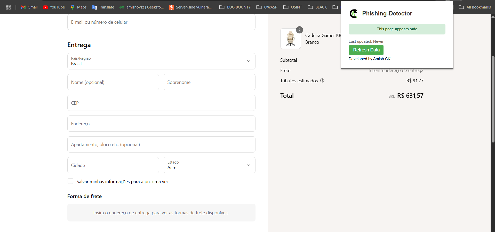
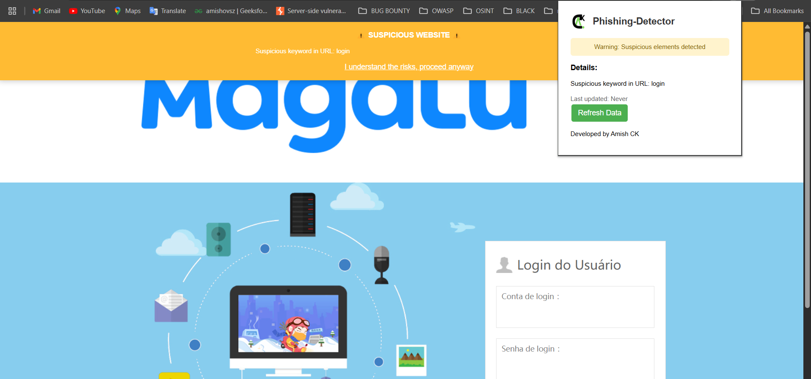

# Phishing-Detector 🛡️🔍

[](https://opensource.org/licenses/MIT)


A Chrome extension that actively protects users from phishing attacks by analyzing websites in real-time and alerting about potential threats.

## Features
- ✅ Real-time phishing detection
- 🚨 Visual warning banners for dangerous sites
- 🔄 Automatic updates of phishing databases
- 🔍 Suspicious keyword analysis
- 🕵️ Domain impersonation detection

## Installation

### Method 1: Chrome Web Store (Recommended)
*(Coming soon)*

### Method 2: Manual Installation
1. Download or clone this repository
2. Open Chrome and navigate to `chrome://extensions/`
3. Enable "Developer mode" (toggle in top-right)
4. Click "Load unpacked" and select the extension folder

## How It Works
1. Continuously monitors browsing activity
2. Checks URLs against:
   - Known phishing databases (PhishTank)
   - Suspicious keyword patterns
   - Domain impersonation techniques
3. Displays appropriate warnings:
   - 🔴 Red alert for confirmed phishing sites
   - 🟡 Yellow warning for suspicious sites

## Screenshots
| Safe Site | Danger |
|-----------|--------|
|   |  |

## Development
```bash
git clone https://github.com/amishck/Phishing-Detector.git
```

# License
MIT License - See [LICENSE](LICENSE) file for details
